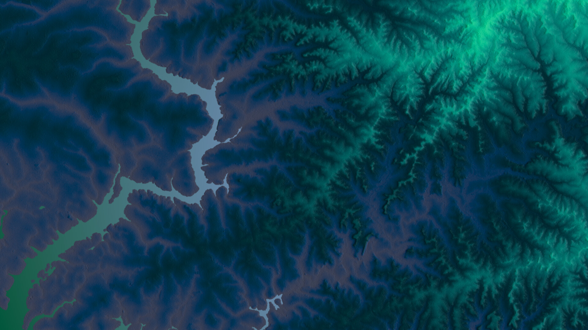
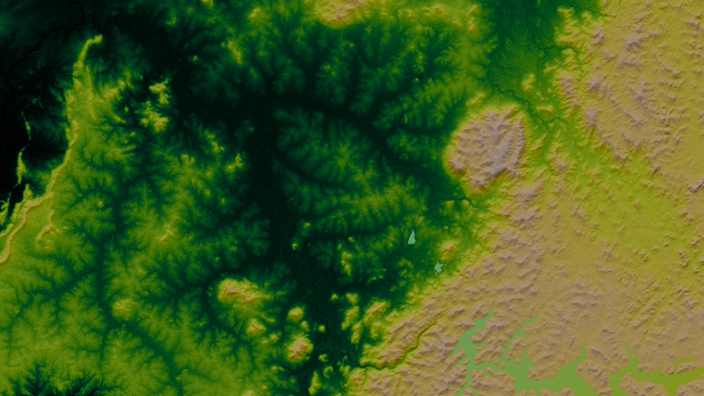

# A Sort of Soup
### or, The Colour Out of Earth

> You see it is so easy for you sitting in Tavistock Square to look inward; but I find it very difficult to look inward when I am also looking at the coast of Sinai; and very difficult to look at the coast of Sinai when I am also looking inward and finding the image of Virginia everywhere. So this combination makes my letter more dumb than usual.

> You have a little compartment for the Press, and another little compartment for Mary Hutchinison, and another for Vita, and another for Dog Grizzle, and another for the Downs, and another for London fogs, and another for the Prince of Wales, and another for the lighthouse, no, I'm wrong, the lighthouse is allowed to play its beam over the whole lot, and their only Common Denominator is your own excitability over whichever compartment you choose to look into at the moment. But with me they all run together into a sort of soup.

> — Vita Sackville-West to Virginia Woolf, 4 February, 1926

This is a python script that downloads a digital elevation model of a random location on earth, from which it produces a randomly-colored shaded terrain map. It gets its data from [SRTM](https://lpdaac.usgs.gov/products/srtmgl1v003/) and [ASTER](https://lpdaac.usgs.gov/products/astgtmv003/) 1 arc second DEMs and [Water](https://lpdaac.usgs.gov/products/srtmswbdv003/) [Body](https://lpdaac.usgs.gov/products/astwbdv001/) Databases. To access these data, the script needs an [Earthdata EOSDIS login](https://urs.earthdata.nasa.gov/users/new), that it will store [encrypted](https://github.com/zoggop/a-sort-of-soup/blob/main/catacomb.py).

## Requirements

- Python 3.9 (Other versions of Python 3 may work, but I haven't tested them.)

#### Python Modules:

- [coloraide](https://facelessuser.github.io/coloraide/)

- [Pillow](https://python-pillow.org/)

- [blend_modes](https://github.com/flrs/blend_modes)

- [opencv-python](https://pypi.org/project/opencv-python/)

- [beautifulsoup4](https://pypi.org/project/beautifulsoup4/)

- [screeninfo](https://pypi.org/project/screeninfo/)

## Usage

```
usage: asos.py [-h] [--new-login] [--one-time-login] [--previous] [--no-water]
               [--no-shade] [--output [FILEPATH]]
               [--coordinates LATITUDE LONGITUDE] [--dimensions WIDTH HEIGHT]
               [--rotation [0-3]] [--maxchroma [0-134]]
               [--hue-delta [Delta-E]] [--lightnesses 0-100 [0-100 ...]]
               [--chromas 0-134 [0-134 ...]] [--hues 0-359 [0-359 ...]]

Create a colorful image of terrain of a random location.

optional arguments:
  -h, --help            show this help message and exit
  --new-login           Enter an Earthdata username & password and store it
                        encrypted for future use. Overwrites currently stored
                        login information if any.
  --one-time-login      Enter an Earthdata username & password to use only for
                        this run, and do not store it.
  --previous, -p        Use previously downloaded data. --dimensions,
                        --coordinates, and --rotation will have no effect.
  --no-water, -w        Do not draw bodies of water.
  --no-shade, -s        Do not hillshade the terrain. This leaves only
                        gradient-mapped elevations and water bodies.
  --output [FILEPATH], -o [FILEPATH]
                        Path to save output image. If not specified, will save
                        to ~/the_colour_out_of_earth/output.png along with
                        elevation_gradient.tif, hillshade.tif, and water.tif
  --coordinates LATITUDE LONGITUDE, -c LATITUDE LONGITUDE
                        Location of center of desired image in latitude
                        longitude coordinates. If not specified, a random
                        location will be chosen.
  --dimensions WIDTH HEIGHT, -d WIDTH HEIGHT
                        Width and height in pixels of output image. Larger
                        images will require downloading more source tiles.
                        Defaults to screen dimensions.
  --rotation [0-3], -r [0-3]
                        How many times 90 degrees to rotate. (0: North is up.
                        1: East is up. 2: South is up. 3: West is up.) If not
                        specified, this will be chosen randomly.
  --maxchroma [0-134]   Maximum chroma of image.
  --hue-delta [Delta-E]
                        Minimum color difference between hues as calculated by
                        CIE Delta-E 2000 at 57 lightness and 32 chroma. Values
                        over 35 will usually cause Delta-E between hues to be
                        uneven. If not specified, this will be chosen randomly
                        between 20 and 40.
  --lightnesses 0-100 [0-100 ...]
                        Up to three lightnesses, in order of elevation. The
                        remaining lightnesses will be chosen randomly.
  --chromas 0-134 [0-134 ...]
                        Up to three chromas, in order of elevation. The
                        remaining chromas will be chosen randomly. To specify
                        only the second and/or third chroma, enter chromas of
                        -1 to have them chosen randomly.
  --hues 0-359 [0-359 ...]
                        Up to three hues, in order of elevation. The remaining
                        hues will be chosen randomly. To specify only the
                        second and/or third hue, enter hues of -1 to have them
                        chosen randomly.
```

## Examples




